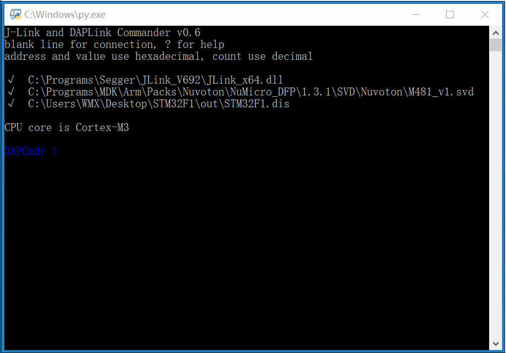

# DAPCmdr
J-LINK Commander like tool for JLink and DAPLink, adding HardFault diagnosis and SVD-based peripheral register access.

To run this tool, you need python 3.6+ and prompt_toolkit 3.0+.

To use DAPLink, you need additional pyusb for CMSIS-DAPv2 and another usb-backend for CMSIS-DAPv1 (hidapi or pywinusb for windows, hidapi for mac, pyusb for linux).

``` shell
pip install prompt_toolkit pyusb hidapi six
```


`√` meaning file exists, `×` meaning not.

## Basic Command
### memory read/write
```
Read  8-bit items. Syntax: rd8 <addr> <count>
Read 16-bit items. Syntax: rd16 <addr> <count>
Read 32-bit items. Syntax: rd32 <addr> <count>

Write  8-bit items. Syntax: wr8 <addr> <value>
Write 16-bit items. Syntax: wr16 <addr> <value>
Write 32-bit items. Syntax: wr32 <addr> <value>
```

### memory read/write to/from file
```
Save target memory into binary file.
Syntax: savebin <filepath> <addr> <NumBytes>

Load binary file into target memory.
Syntax: loadbin <filepath> <addr>
```

### core register read/write
```
DAPCmdr > wreg r0 12345678

DAPCmdr > regs
R0 : 12345678    R1 : 0000000A    R2 : 00146BAB    R3 : 044AA200
R4 : 0000000A    R5 : 40011000    R6 : 20000000    R7 : 40010800
R8 : 00008000    R9 : 20000160    R10: 00000000    R11: 00000000
R12: 00000001    SP : 20000420    LR : 08000247    PC : 08000226
MSP: 20000420    PSP: 20000800    XPSR: 01000000
CONTROL: 00 (when Thread mode: privileged, use MSP)
```

### device control
* reset
* halt
* go

## HardFault Diagnosis
`halt` and `regs` command will detect if `HardFault` happened, if so, they will analysize and print the cause, Stack Content and CallStack.
```
DAPCmdr > halt
R0 : 20000000    R1 : 00000001    R2 : 00000000    R3 : 08000DA9
R4 : 08000E08    R5 : 08000E08    R6 : 00000000    R7 : 00000000
R8 : 00000000    R9 : 20000160    R10: 00000000    R11: 00000000
R12: 00000000    SP : 200003E0    LR : FFFFFFF9    PC : 08000422
MSP: 200003E0    PSP: 20000800    XPSR: 61000003
CONTROL: 00 (when Thread mode: privileged, use MSP)

a divide by zero has taken place (can be set only if DIV_0_TRP is set)

Stack Content @ 0x200003E0:
200003E0:  20000000 00000001 00000000 08000DA9 00000000 080001C9 0800015C 61000000
20000400:  00000000 00000000 00000000 00000000 00000000 00000000 00000000 08000E08
20000420:  08000E08 080001C9 00000000 08000DA9 08000E08 08000D81 FFFFFFFF FFFFFFFF

Call Stack:
0x0800015C  SerialInit
0x080001C9  main
```
to print CallStack, you need to specify elf file using `path elf` command.

### dis
```
display CallStack information coming from elf file.
```

## SVD-based peripheral register access
```
svd-based peripheral register read and write
register read:        sv <peripheral>.<register>
register write:       sv <peripheral>.<register> <hex>
register field write: sv <peripheral>.<register>.<field> <dec>
```
when typing peripheral/register/field name, DAPCmdr will do auto-completion.

## Other Command
### path
```
display path, Syntax: path
set JLink_x64.dll, Syntax: path dll <dllpath>
set svd file path, Syntax: path svd <svdpath>
set elf file path, Syntax: path elf <elfpath>
```
when typing path, DAPCmdr will do auto-completion.

### env
```
DAPCmdr > env
%pwd%     C:\Users\WMX\Desktop
%home%    C:\Users\WMX
%Packs%   C:\Programs\MDK\Arm\Packs
```
these variables can be used in path typing.
